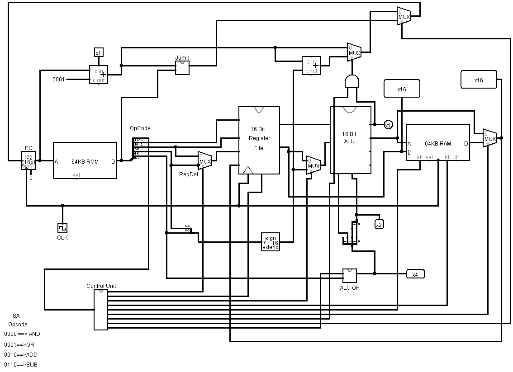

# 16-bit-cpu-MIPS

implementation of 16 bit CPU (MIPS architecture) for Computer Architecture course

**Op-code and Function Bits Mapping**

| Opcode | Instruction Type | ALU-OP | Func | Instruction Operation | Registered ALU Op | ALU Control Bits |
| ------ | ---------------- | ------ | ---- | --------------------- | ----------------- | ---------------- |
| 000    | R-type           | 10     | 0000 | ADD                   | ADD               | 0010             |
| 000    | R-type           | 10     | 0010 | SUB                   | SUB               | 0110             |
| 000    | R-type           | 10     | 0100 | AND                   | AND               | 0000             |
| 000    | R-type           | 10     | 0101 | OR                    | OR                | 0001             |
| 001    | lw               | 00     | xxxx | Load word             | ADD               | 0010             |
| 010    | sw               | 00     | xxxx | store word            | ADD               | 0010             |
| 011    | Beq              | 01     | xxxx | branch if equal       | SUB               | 0110             |
| 100    | Jump             | XX     | xxxx | Jump                  |                   |                  |

| ALU-op | Func | ALU-Control-Bit |
| ------ | ---- | --------------- |
| 10     | 0000 | 0010            |
| 10     | 0010 | 0110            |
| 10     | 0101 | 0001            |
| 10     | xxxx | 000             |
| 00     | xxxx | 001             |
| 00     | xxxx | 001             |
| 01     | xxxx | 011             |

ALU-Control-0 = (ALU-OP_1.F0)

ALU-Control-1 = NOT(ALU-OP-1) + NOT(F2)

ALU-Control-2 = (ALU-OP-1.F1) + ALU-OP-0

ALU-Control_3 = 0

## Instruction Set

| Input/Output | Opcode   | R-type | lw   | sw   | Beq  | Jump |
| ------------ | -------- | ------ | ---- | ---- | ---- | ---- |
| Input        | op2      | 0      | 0    | 0    | 0    | 1    |
|              | op1      | 0      | 0    | 1    | 1    | 0    |
|              | op0      | 0      | 1    | 0    | 1    | 0    |
| Output       | RegDst   | 1      | 0    | x    | x    | x    |
|              | RegWrite | 1      | 1    | 0    | 0    | 0    |
|              | ALUSrc   | 0      | 1    | 1    | 0    | x    |
|              | MemRead  | 0      | 1    | 0    | 0    | 0    |
|              | MemWrite | 0      | 0    | 1    | 0    | 0    |
|              | MemtoReg | 0      | 1    | X    | X    | X    |
|              | Branch   | 0      | 0    | 0    | 1    | 0    |
|              | Jump     | 0      | 0    | 0    | 0    | 1    |
|              | Alu-Op-1 | 1      | 0    | 0    | 0    | x    |
|              | ALU-OP-0 | 0      | 0    | 0    | 1    | x    |
|              |          |        |      |      |      |      |

# Instruction Format

| Opcode | RS   | RT   | RD   | Function |
| ------ | ---- | ---- | ---- | -------- |
|        |      |      |      |          |

